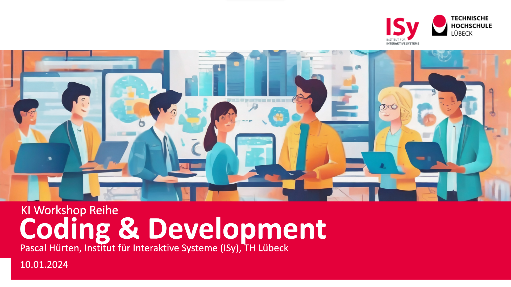

# KI Workshopreihe - Coding & Development @ ISy/ZDL



## Description

This repository serves as a documentation and collection of resources for a workshop on AI-Tools in Coding and Development. It contains various examples, demos, and notebooks that illustrate the use of AI in software development.

## Contents

- `coding_assistant_demo.ipynb`: A Jupyter notebook demonstrating the use of an AI coding assistant.
- `llm-chat_demo.ipynb`: A Jupyter notebook demonstrating the use of a language model for chatbot development.

## Installation

To install the necessary dependencies, run the following command in your terminal:

```bash
pip install -r requirements.txt
```
